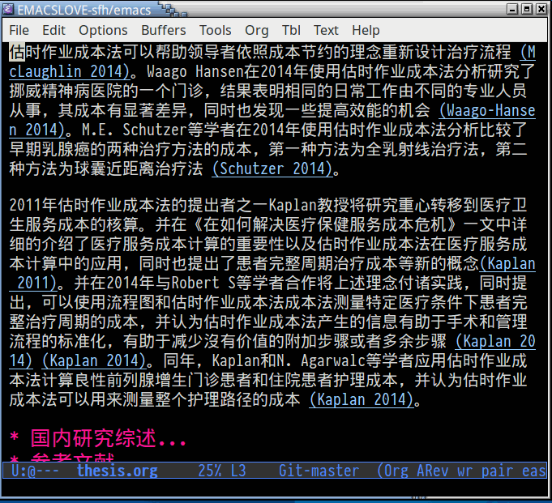

- [README](#readme)
  - [Installation](#installation)
  - [Usage](#usage)

# README

ox-bibtex-chinese is an extension of ox-bibtex, which can help chinese user
to export bibliography to html.

## Installation

ox-bibtex-chinese is now available from the famous emacs package repo
[melpa](http://melpa.milkbox.net/), so the recommended way is to install it
through emacs package management system.

## Usage

1.  Install bibtex2html to your system
2.  Configure emacs

        (require 'org)
        (require 'ox-bibtex)
        (require 'ox-bibtex-chinese)
        (ox-bibtex-chinese-enable)
3.  See the format of "example/thesis.org" and try export it to html file.
